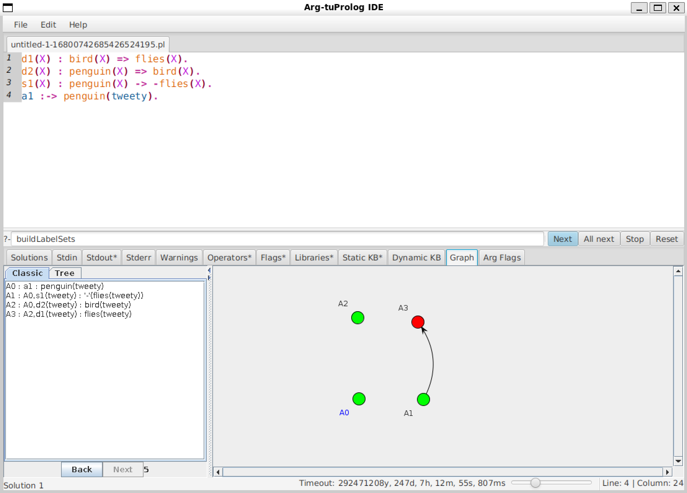
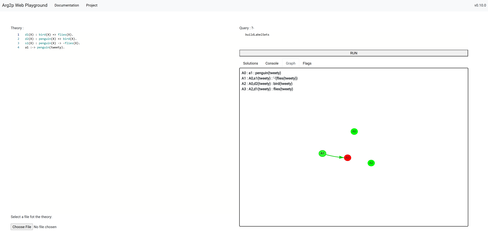

# Arg2P

Arg2P is a lightweight implementation of the ASPIC<sup>+</sup> framework for structured argumentation.
Built on top of the [tuProlog](http://pika-lab.gitlab.io/tuprolog/2p-kt/) engine, it supports both JVM and Node environments.

More details are available on the [official wiki](https://pika-lab.gitlab.io/argumentation/arg2p-kt/).

---

## Getting Started

Arg2p is available as a [2P-Kt](http://pika-lab.gitlab.io/tuprolog/2p-kt/) library.

#### JVM Library - Gradle

To import the Arg2p module (version `ARG2P_VERSION`) into your Kotlin-based Gradle project, declare the dependency in your `build.gradle(.kts)` file:
 ```kotlin
repositories {
    mavenCentral()
}

dependencies {
    implementation("it.unibo.tuprolog.argumentation:arg2p-jvm:ARG2P_VERSION")
}
 ```

#### Usage Example

```kotlin
import it.unibo.tuprolog.argumentation.core.Arg2pSolverFactory
import it.unibo.tuprolog.argumentation.core.libs.basic.FlagsBuilder

fun main() {
    val graph = Arg2pSolverFactory.evaluate("""
        f1 :=> d.
        f2 :=> -d.
    """.trimIndent(), FlagsBuilder()).first()

    graph.labellings.forEach {
        println("${it.label} : ${it.argument.conclusion}")
    }
}
``` 

For a complete example, check out the [GitHub demo](https://github.com/Gilbocc/arg2p-kt-demo).

#### NPM Library

The Arg2P software is available on NPM as a JavaScript library as well. It can be found under the [`@tuprolog` organization](https://www.npmjs.com/org/tuprolog).
To use the library, add the dependency to your `package.json`:

```json
{
  "dependencies": {
    "@tuprolog/arg2p": "ARG2P_VERSION"
  }
}
```

#### Usage Example

```js
const arg2p = require('@tuprolog/arg2p').it.unibo.tuprolog.argumentation.bridge.JsBridge

const graph = arg2p.solve('buildLabelSets', `
    f1 :=> d.
    f2 :=> -d.`, `
    graphBuildMode(standard_af).
    statementLabellingMode(statement).
    argumentLabellingMode(grounded_hash).
    orderingPrinciple(last).
    orderingComparator(elitist).
    graphExtension(standardPref).
    queryMode.`, _ => { }).i.next().graph

graph.arguments.forEach(arg => {
    console.log(`${arg.label} : ${arg.descriptor}`)
})
```

For a complete example, see the [repository](https://github.com/tuProlog/arg2p-kt-web).

---

## Arg2p IDE

The Arg2p IDE is available on the [Releases section of the
GitHub repository](https://github.com/tuProlog/arg2p-kt/releases/latest).



In the [latest release](https://github.com/tuProlog/arg2p-kt/releases/latest) page, download the _Asset_ named:
```
arg2p-ide-ARG2P_VERSION-redist.jar
```
a self-contained, executable Jar containing the 2P-Kt-based Prolog interpreter (`ARG2P_VERSION` will vary depending on the
actual release version).

After you download the `arg2p-ide-ARG2P_VERSION-redist.jar`, you can simply launch it by running:
```bash
java -jar arg2p-ide-ARG2P_VERSION-redist.jar
```
If your JVM is properly configured, you can also start the IDE by double-clicking the JAR file.

### Features

- **Query Execution:** Write your query in the text field and hit <kbd>Enter</kbd> or click <kbd>&gt;</kbd>.
- **Solution Exploration:** Click <kbd>&gt;</kbd> for the next solution or <kbd>&gt;&gt;</kbd> to compute all solutions.
- **New Query:** Click <kbd>X</kbd> to stop the current query, then enter a new one.

### Additional Tabs

- **Graph Tab:** Displays a graphical representation of the abstract argumentation graph.
- **Arg Flag Tab:** Shows and allows modification of Arg2P flags. Detailed descriptions are on the [official wiki](https://pika-lab.gitlab.io/argumentation/arg2p-kt/wiki/predicate).

---

## Arg2p Playground

Try Arg2P directly in your browser using the [Web Playground](https://legalmachinelab.unibo.it/arg2p).



It functions the same as the Java IDE, offering an interactive experience without installation.

---

## Issue tracking

If you encounter any issues, please report them on the [GitHub Issues](https://github.com/tuProlog/arg2p-kt/issues) page.  
Your feedback helps improve the project!
